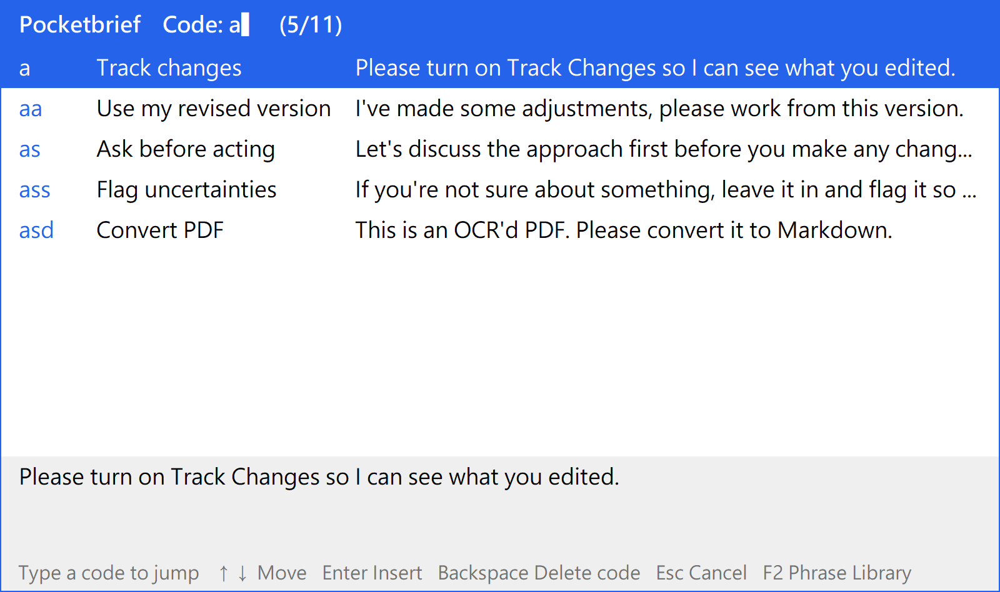
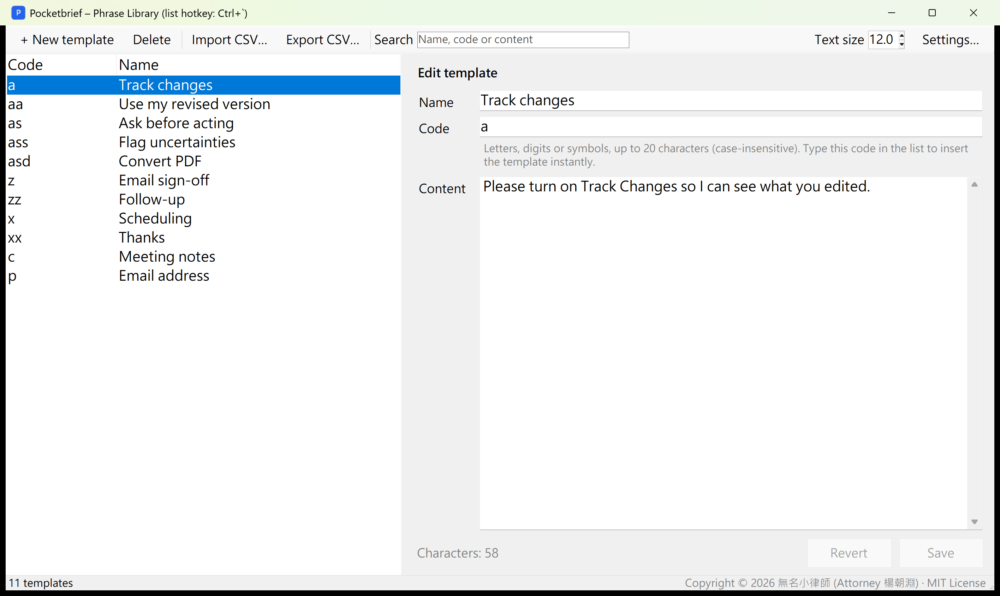
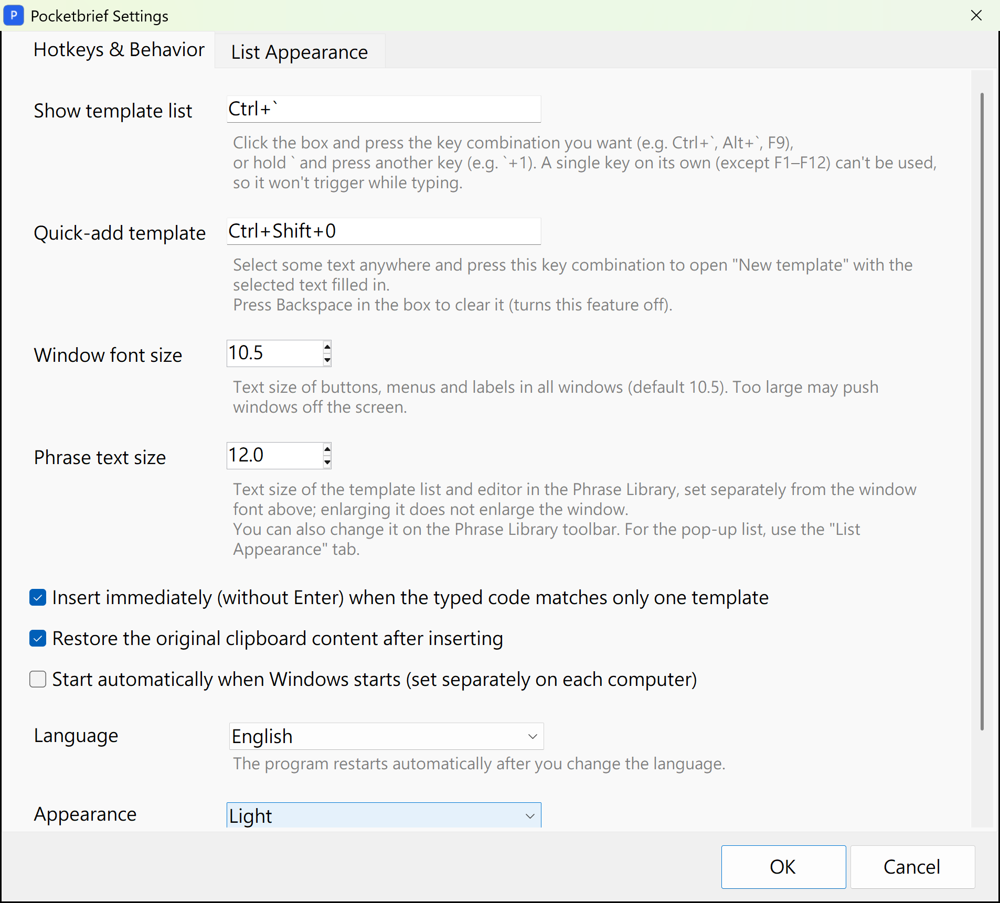

<div align="center">

# Pocketbrief（口袋句庫）

**Press a hotkey to pop up your saved phrases, type a short code, and the whole phrase is typed at your cursor.**

Windows ／ macOS

[繁體中文](README.md) ｜ English



</div>

---

## What is it?

Pocketbrief is a small background utility for Windows and macOS for the long, fixed phrases you type over and over.

Save each phrase as a template with a short **code**. Then, anywhere you can type (Word, your browser, a chat app, an AI prompt box), press the hotkey (`Ctrl` + `` ` `` on Windows, `⌃` + `` ` `` on a Mac) to pop up your phrase list and type the code. The whole phrase is inserted right where your cursor is.

For example:

| You type | Pocketbrief inserts |
|---|---|
| `a` | Please turn on Track Changes so I can see what you edited. |
| `z` | Best regards,<br>[Your Name] |
| `p` | name@example.com |

It was built by a litigation lawyer for party names and contract titles in court filings, email sign-offs, canned replies, and the prompts you give AI tools every day. It works for anyone who types the same things again and again.

## Features

- ⚡ **Type a code, get the phrase**: when a code matches exactly one template, it is inserted immediately, with no Enter needed. You can also type a keyword to search names and content.
- ✂️ **Quick add**: select any text, anywhere, and press `Ctrl` + `Shift` + `0` (`⌃⇧0` on a Mac) to save it as a new template.
- 💻 **Windows and Mac**: both versions share the same library file. Keep it in a cloud drive, and templates you edit on Windows show up on your Mac too.
- ♾️ **No limits**: store as many templates as you like and use them on as many computers as you like.
- ☁️ **Sync across computers**: keep the folder in Google Drive, OneDrive, iCloud Drive or Dropbox. Edit once and every computer gets the change.
- 🔒 **Your data stays yours**: templates live in a CSV file in a folder you choose. Pocketbrief never connects to the internet.
- ⌨️ **Configurable hotkeys**: the default combinations won't fire by accident while you type. You can also use "hold `` ` `` and press a key" (e.g. `` ` `` + `1`) for an even smaller left-hand move.
- 🎨 **Customizable look**: choose the font, size, colors, width and number of rows of the pop-up list, or pick one of 10 built-in color themes, including two eye-friendly ones.
- 🌙 **Dark mode**: follow the system or choose light or dark yourself.
- 🌐 **Four UI languages**: English, 日本語, 繁體中文, 简体中文.
- 📥 **CSV import/export**: bring templates over from other tools or back them up anywhere.
- 🛡️ **Safe saving**: every save goes through a temporary file, so you never end up with a half-written file. A backup is also made automatically before the first change on any day you edit, and the 14 most recent backups are kept.

## Screenshots

These are from the Windows version; the Mac version has the same layout.

**Phrase Library** lists your templates on the left; edit on the right and press `Ctrl` + `S` (`⌘S` on a Mac) to save.



**List Appearance** lets you apply one of 10 color themes with a single click, fine-tune any color, and watch a live preview.



---

## Download & install

Download the latest version from [Releases](../../releases/latest):

| File | For |
|---|---|
| `Pocketbrief-v<version>-windows.zip` | Windows 10/11 |
| `Pocketbrief-v<version>-mac.zip` | macOS 13 Ventura or later (Apple silicon and Intel Macs) |

### Windows

**Requirements**: Windows 10 or Windows 11, with .NET Framework 4.8 (already built into Windows 10/11).

1. Download `Pocketbrief-v<version>-windows.zip` and unzip it into any folder. **To sync across computers, unzip it into your cloud-sync folder.**
2. Double-click `Pocketbrief.exe`. No installation is needed.
3. A tray icon appears at the bottom right, which means Pocketbrief is running.

> [!NOTE]
> **Windows may show "Windows protected your PC".**
> Pocketbrief is not code-signed, so Windows SmartScreen may warn you the first time you run it. Click **More info → Run anyway**.
> The full source code is public, so you can also [build it yourself](#build-from-source).

**Start with Windows**: open **Settings → Hotkeys & Behavior** and check **Start automatically when Windows starts**. This is set separately on each computer.

### Mac

**Requirements**: macOS 13 Ventura or later, on Apple silicon (M1 or later) or Intel.

1. Download `Pocketbrief-v<version>-mac.zip` and double-click it to unzip. You get `Pocketbrief.app`.
2. Drag `Pocketbrief.app` into your **Applications** folder.
3. **Opening it the first time**: Pocketbrief doesn't have a paid Apple Developer signature, so macOS blocks it at first:
   - **macOS 15 Sequoia or later**: double-click the app once (it will be blocked), then go to **System Settings → Privacy & Security**, scroll down to **Security**, click **Open Anyway** next to Pocketbrief, and confirm with your password.
   - **macOS 13 or 14**: right-click (or control-click) `Pocketbrief.app` → **Open**, then click **Open** again.
4. **Choose a library folder**: on first launch, Pocketbrief asks where to keep your templates.
   - If Google Drive is installed on this Mac and the Windows version already uses a "口袋句庫 Pocketbrief" folder there, Pocketbrief finds it automatically. Choose **Use This Folder** to share one library with Windows.
   - Otherwise, choose **Choose Folder…** to pick one yourself, or **Use Default (Documents)**.
5. **Turn on Accessibility**: Pocketbrief needs this permission to paste templates at your cursor. Follow the prompt to **System Settings → Privacy & Security → Accessibility** and turn on Pocketbrief.
6. A "句" icon appears in the menu bar (top right of the screen), which means Pocketbrief is running.

> [!IMPORTANT]
> **After every Mac update, turn the Accessibility permission on again.**
> Because the app isn't signed, macOS treats each new version as a different app. Go to **System Settings → Privacy & Security → Accessibility**, select the old Pocketbrief and click **–** to remove it, then click **+** to add the new one (or just reopen the app and follow the prompt). Do the same for Input Monitoring if you use it.

**Launch at login**: open **Settings → Hotkeys & Behavior** and check **Launch at login**. If macOS asks for approval, allow Pocketbrief in **System Settings → General → Login Items**.

**`` ` `` prefix hotkeys** (e.g. `` ` `` + `1`): besides Accessibility, also turn on Pocketbrief in **System Settings → Privacy & Security → Input Monitoring**, then restart the app.

---

## How to use

### Basics

| To… | Windows | Mac |
|---|---|---|
| Show the phrase list | Press `Ctrl` + `` ` `` (the key below `Esc`) wherever you're typing | Press `⌃` + `` ` `` (control plus the key below `esc`) |
| Insert a phrase | Type its code. It's inserted as soon as only one template matches; otherwise pick one with `↑` `↓` and press `Enter` | Same, press `return` |
| Search | If what you type doesn't match any code, names and content are searched instead (e.g. type `pdf`) | Same |
| Cancel | `Esc` | `esc` |
| Quick-add a template | Select text, then press `Ctrl` + `Shift` + `0` | Select text, then press `⌃⇧0` |
| Open the Phrase Library | Click the tray icon, or press `F2` in the list | Menu bar icon → **Phrase Library…**, or press `F2` in the list (laptops may need `fn`) |
| Open Settings | **Settings…** at the top right of the Phrase Library, or right-click the tray icon | **Settings…** at the top right of the Phrase Library, or menu bar icon → **Settings…** |

### Phrase Library

- **Add**: click **+ New template** (`Ctrl` + `N` / `⌘N`), fill in the name, code and content on the right, then click **Save** (`Ctrl` + `S` / `⌘S`).
- **Edit**: click a template on the left and edit it on the right. If you switch away with unsaved changes, Pocketbrief asks first.
- **Delete**: select templates and click **Delete** (`Delete` / `⌫`). Hold `Ctrl` or `Shift` (`⌘` or `⇧` on a Mac) to select several.
- **Sort**: click a column header to sort by code or name.
- **Text size**: the **Text size** control on the toolbar enlarges only the list and editor text, not the window or buttons.

### Tips for choosing codes

- Give your most-used templates codes on the **left side** of the keyboard (`a`, `s`, `z`, `x`…) so your left hand can reach them right after the hotkey.
- Let related templates share a prefix, e.g. `a`, `aa`, `as`, `ass`.
- When codes share a prefix (e.g. `a` and `aa`), typing `a` pauses the list. Press `Enter` to insert `a`, or keep typing.
- Codes may contain letters, digits and half-width symbols, up to 20 characters, and are case-insensitive. Spaces, CJK characters and `` ` `` are not allowed.

### Using `` ` `` as a hotkey prefix

Besides `Ctrl`/`Alt` combinations (`⌃`, `⌥`, `⌘` on a Mac), you can set a hotkey as "hold `` ` `` and press a key", e.g. `` ` `` + `1`, so your left hand doesn't have to reach for `Ctrl`. To set it, click the hotkey box in Settings, hold `` ` `` and press `1`.

With a combination like this:

- Tapping `` ` `` on its own still types `` ` ``; it just appears when you release the key, and holding it down doesn't repeat.
- If you press another key while holding `` ` `` (e.g. `a`), you get "`` ` ``a" in order, so typing isn't affected.
- `Shift` + `` ` `` (~), `Ctrl` + `` ` `` and similar combinations are unaffected.
- If you type fast and hit `1` before releasing `` ` `` (e.g. typing `` `1` `` in Markdown), it counts as the hotkey.
- On a Mac, this also needs the Input Monitoring permission (see [Mac install](#mac)).

### First run

Try the sample library: in the Phrase Library, click **Import CSV…** and choose [`examples/sample-phrases-en.csv`](examples/sample-phrases-en.csv).

### Language

Pocketbrief follows your system language. To change it, open **Settings → Hotkeys & Behavior → Language**. The program restarts automatically.

### Settings

| Tab | Options |
|---|---|
| Hotkeys & Behavior | Hotkey for the list, quick-add hotkey, phrase text size, insert immediately on a unique match, restore the clipboard after inserting, start automatically, language, appearance (light / dark / follow system)<br>Windows also has window font size; Mac also has the library folder and permission status |
| List Appearance | Color theme, font, font size, list width, number of rows, individual colors |

---

## Syncing across computers

Keep the library folder in a cloud-sync folder and point every computer at the same folder:

- **Windows**: put the whole program folder in your cloud drive and run `Pocketbrief.exe` from there. Templates are stored next to the program.
- **Mac**: choose the same folder in your cloud drive on first launch (or later in **Settings → Library folder**).

The folder contains these files (the file names are in Chinese; this is expected):

| File | Contents |
|---|---|
| `範本.csv` | All your templates (shared by Windows and Mac) |
| `設定.ini` | Windows settings (hotkeys, appearance, language and so on) |
| `設定-Mac.ini` | Mac settings (kept separate because hotkeys are written differently) |
| `備份\` | Automatic backups (one per day you make changes; the 14 most recent are kept) |

A change made on one computer shows up on the others the next time you open the list.

> [!TIP]
> If two computers edit at almost the same moment, your cloud service may create a conflicted copy (e.g. a file name ending in "(1)") that you'll need to merge by hand. Pocketbrief itself never treats a half-synced or empty file as real data, and never writes an empty file over your synced templates.

## Template file format

`範本.csv` is a UTF-8 CSV file. The first row holds the column names, and each following row is one template:

```csv
名稱 Name,代碼 Code,內容 Content
Track changes,a,Please turn on Track Changes so I can see what you edited.
Email sign-off,z,"Best regards,
[Your Name]"
```

- Content can span multiple lines; just wrap it in double quotes.
- When importing other CSV files, Pocketbrief detects the column order, whether there is a header row, and UTF-8 or Big5 encoding.

> [!WARNING]
> It's fine to **view** the file in Excel, but avoid **editing and re-saving** it there. Excel drops leading zeros from codes (`01` becomes `1`), turns `1-2` into a date, and treats content starting with `=` or `+` as a formula. Edit templates in the Phrase Library instead.

---

## Privacy & security

- Pocketbrief **never connects to the internet**. There is no telemetry, advertising or reporting of any kind.
- Your templates stay in the folder you choose.
- To paste a phrase into the current window, Pocketbrief briefly borrows the clipboard and restores your original clipboard about one second later.
- Because Pocketbrief registers global hotkeys and simulates `Ctrl` + `V` and `Ctrl` + `C` (`⌘V` and `⌘C` on a Mac), a few antivirus products may flag it. The source code is fully public, so you can inspect or build it yourself.
- On a Mac, the Accessibility permission is used only to send `⌘V`/`⌘C` and to find the cursor position. Input Monitoring is needed only for `` ` `` prefix hotkeys.
- If you set a hotkey like "`` ` `` + a key", Pocketbrief watches the keyboard so it can tell which key follows `` ` ``. It only checks for that combination; nothing you type is recorded or sent anywhere. With regular modifier combinations it doesn't watch the keyboard at all.

## Known limitations

- Windows: Windows does not let ordinary programs send keystrokes to windows running **as administrator**, so Pocketbrief cannot paste into them.
- Windows: in dark mode, built-in Windows dialogs (confirmations, file pickers, color picker) remain light.
- Mac: there is no paid Apple Developer signature, so you have to allow the app the first time and turn Accessibility on again after each update.
- Mac: window text follows the system size; there is no "window font size" option as on Windows.
- Linux is not supported.

---

## FAQ

<details>
<summary><b>Does it work alongside Chinese, Japanese or other input methods?</b></summary>

Yes. Once the list pops up, whatever you type is read as plain letters, so you don't need to switch input methods first.
</details>

<details>
<summary><b>The hotkey conflicts with another program. What can I do?</b></summary>

Open **Settings → Hotkeys & Behavior**, click the hotkey box and press the combination you want. A "`` ` `` + a key" combination almost never clashes with other programs. Common system shortcuts such as copy and paste can't be used.
</details>

<details>
<summary><b>Will I lose what was on my clipboard?</b></summary>

No. About one second after inserting a phrase, Pocketbrief restores your clipboard. If you copy something else in that moment, your new copy wins. You can turn this off in Settings.
</details>

<details>
<summary><b>On a Mac, the list appears but nothing is pasted after I type a code.</b></summary>

Usually the Accessibility permission is off, or it wasn't re-added after an update. Go to **System Settings → Privacy & Security → Accessibility**, remove Pocketbrief and add it again. While the permission is off, the phrase is placed on the clipboard so you can press `⌘V` yourself.
</details>

<details>
<summary><b>Can I move my phrases over from another tool?</b></summary>

Yes. Export them as CSV (with name, code and content columns) and use **Import CSV…**. If a code already exists with different content, Pocketbrief asks whether to replace it or keep both.
</details>

<details>
<summary><b>I broke or deleted something by mistake.</b></summary>

Open the `備份` (backup) folder inside your library folder, find `範本_<date>.csv` from before the change, and bring it back with **Import CSV…**.
</details>

---

## Build from source

### Windows

You don't need Visual Studio. The C# compiler ships with the .NET Framework built into Windows. In the project folder, run:

```bat
build.cmd
```

This produces `dist\Pocketbrief.exe`.

### Mac

You need Xcode or the Xcode Command Line Tools (run `xcode-select --install` in Terminal). In the project folder, run:

```bash
cd macos && ./build.sh
```

This produces `macos/dist/Pocketbrief.app` and a zip of it.

### Source layout

| File | Contents |
|---|---|
| `src/Pocketbrief.cs` | Windows main program: hotkeys, pop-up list, Phrase Library, settings, saving |
| `src/Lang.cs`, `src/LangTable.cs` | Windows UI languages and translations |
| `src/Theme.cs` | Windows dark mode |
| `macos/Sources/Pocketbrief/` | Mac version (Swift): the same features, split into files by feature |
| `macos/build.sh` | Mac build and packaging |
| `examples/` | Sample libraries (Traditional Chinese, English) |

### Contributing

- The Windows version is C# 5 using only what ships with .NET Framework 4.x; the Mac version is Swift using only macOS's built-in frameworks. Neither has third-party dependencies.
- UI strings are written in Traditional Chinese inside `L.T("…")` (`L.t("…")` on Mac). Add the English and Japanese translations to the translation table (`src/LangTable.cs`, `macos/Sources/Pocketbrief/LangTable.swift`); Simplified Chinese is converted automatically.
- Bug reports and suggestions are welcome in Issues.

---

## License

Pocketbrief is open source under the [MIT License](LICENSE). You're free to use, modify and distribute it.

© 2026 無名小律師 (Attorney 楊朝淵)

Pocketbrief was built by "vibe coding" with the help of AI (Claude Code).
