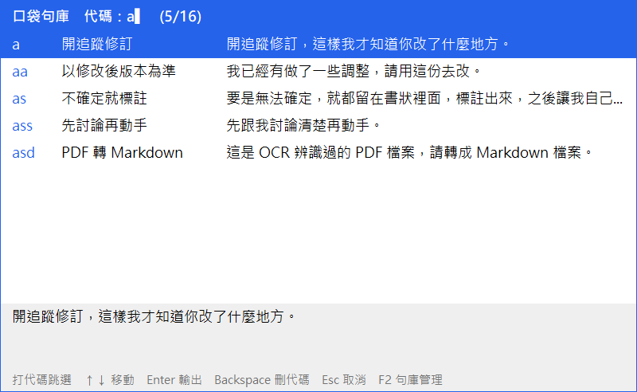
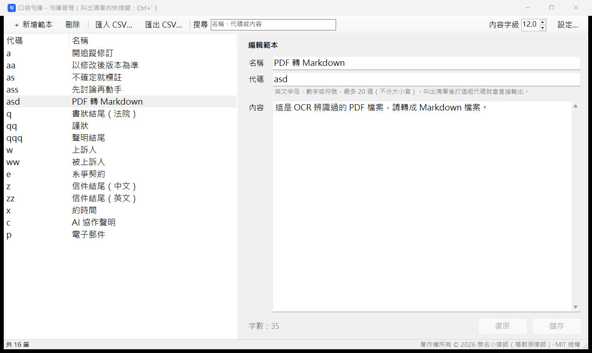
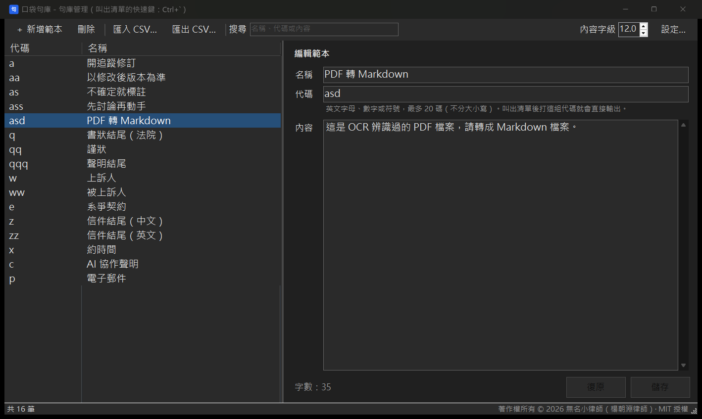
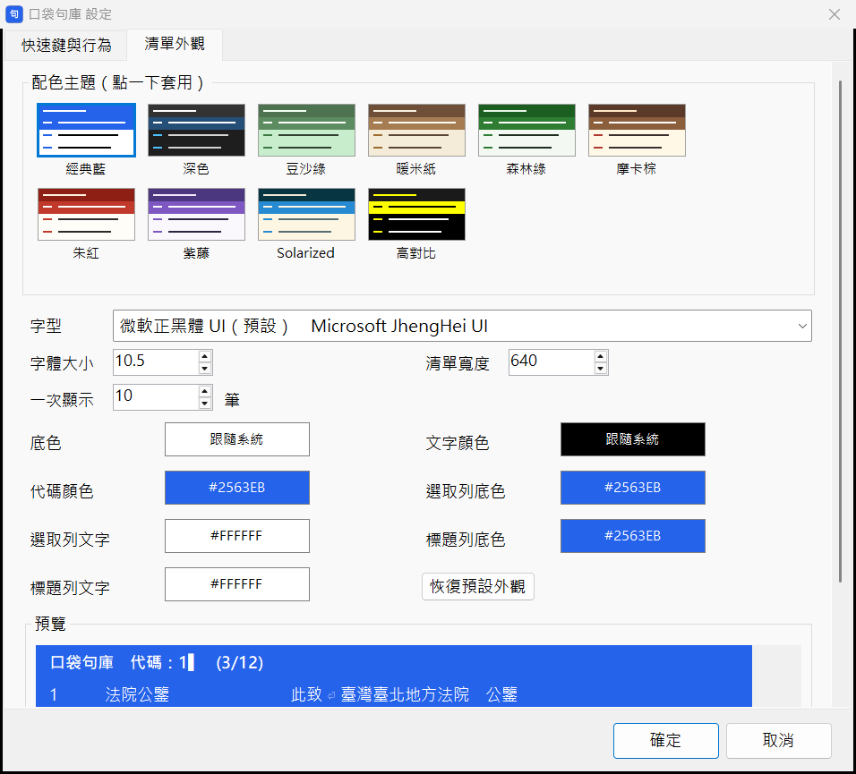

<div align="center">

# 口袋句庫 Pocketbrief

**按一個快速鍵叫出常用句清單，打幾個字母，整句話就輸入到游標所在的位置。**

繁體中文 ｜ [English](README.en.md)



</div>

---

## 這是什麼？

口袋句庫是一個 Windows 常駐小工具，用來快速輸入「常常要打、又很長」的固定詞句。

先把常用句存成範本，並替每一筆設定一組短短的**代碼**。之後不論在 Word、瀏覽器、LINE、AI 對話框，還是任何可以打字的地方，只要按下 `Ctrl` + `` ` ``，就會叫出句庫清單；再打代碼，整句話就直接輸入進去。

例如：

| 打的代碼 | 輸入的內容 |
|---|---|
| `a` | 開追蹤修訂，這樣我才知道你改了什麼地方。 |
| `w` | 上訴人○○股份有限公司 |
| `q` | 此致<br>臺灣臺北地方法院　公鑒 |

適合需要反覆輸入固定詞句的人：書狀裡的當事人稱謂和契約名稱、信件開頭與結尾、客服罐頭回覆，或是每天下給 AI 的慣用指令。

## 功能特色

- ⚡ **打代碼就輸出**：代碼只對應到一筆時直接輸出，不必再按 Enter；也可以打英文關鍵字搜尋名稱與內容。
- ✂️ **反白即存**：在任何地方反白一段文字，按 `Ctrl` + `Shift` + `0`，就能存成新範本。
- ♾️ **沒有數量上限**：範本要存幾筆都可以，要裝幾台電腦都可以。
- ☁️ **跨電腦同步**：把資料夾放在 Google 雲端硬碟、OneDrive 或 Dropbox 裡，改一次，每台電腦都跟著更新。
- 🔒 **資料留在你手上**：範本存在程式旁邊的 CSV 檔，程式完全不連網。
- ⌨️ **快速鍵可自訂**：預設 `Ctrl` + `` ` ``，打中文時不會誤觸；也可以改成「按住 `` ` `` 再按一個鍵」（例如 `` ` `` + `1`），左手動作更小。
- 🎨 **外觀可自訂**：清單的字型、字體大小、顏色、寬度、顯示筆數都能調整，並內建 10 種配色主題（含兩款護眼配色）。
- 🌙 **深色模式**：可跟隨 Windows，或手動切換淺色／深色。
- 🌐 **多語言介面**：繁體中文、English、日本語、简体中文。
- 📥 **CSV 匯入／匯出**：方便從其他工具搬過來，或備份到別處。
- 🛡️ **資料保護**：存檔時先寫暫存檔再替換，不會出現寫到一半的檔案；每天第一次修改前會自動備份，保留最近 14 天。

## 畫面

**句庫管理**：左邊是範本清單，右邊直接編輯，按 `Ctrl` + `S` 儲存。

| 淺色模式 | 深色模式 |
|---|---|
|  |  |

**清單外觀**：10 種配色主題點一下就套用，下方可以再微調個別顏色，並即時預覽。



---

## 下載與安裝

### 系統需求

- Windows 10 或 Windows 11
- .NET Framework 4.8（Windows 10／11 已內建，不必另外安裝）
- 目前**不支援 macOS 與 Linux**

### 安裝步驟

1. 到 [Releases](../../releases/latest) 下載最新版的 zip 檔。
2. 解壓縮到任何資料夾。**想跨電腦同步的話，請解壓縮到雲端硬碟的同步資料夾裡。**
3. 對 `Pocketbrief.exe` 點兩下。不需要安裝。
4. 右下角系統匣出現「句」字圖示，就代表程式正在執行。

> [!NOTE]
> **Windows 可能會跳出「Windows 已保護您的電腦」**
> 因為程式沒有付費的數位簽章，第一次執行時 Windows SmartScreen 可能會提醒。請按「其他資訊」→「仍要執行」。
> 原始碼全部公開，不放心的話可以[自行編譯](#自行編譯)。

### 開機自動啟動

到「設定」→「快速鍵與行為」，勾選「開機時自動啟動」。這是每台電腦各自的設定，要在每台電腦各勾一次。

---

## 使用說明

### 基本操作

| 想做的事 | 做法 |
|---|---|
| 叫出範本清單 | 在要打字的地方按 `Ctrl` + `` ` ``（`Esc` 下面那顆鍵） |
| 輸出範本 | 打代碼。只對應到一筆時直接輸出；否則用 `↑` `↓` 選，按 `Enter` 輸出 |
| 用關鍵字找 | 打的英文或數字對不到任何代碼時，會改搜尋名稱與內容（例如打 `pdf`） |
| 取消 | `Esc` |
| 快速新增範本 | 反白一段文字，按 `Ctrl` + `Shift` + `0` |
| 開啟句庫管理 | 點系統匣的「句」圖示，或在清單裡按 `F2` |
| 開啟設定 | 句庫管理右上角的「設定…」，或在系統匣圖示按右鍵 |

### 句庫管理

- **新增**：按工具列的「＋ 新增範本」（`Ctrl` + `N`），在右邊填好名稱、代碼、內容後按「儲存」（`Ctrl` + `S`）。
- **修改**：在左邊點一筆，直接在右邊修改後儲存。切換到別筆時，如果有沒存的修改，程式會先問你。
- **刪除**：在左邊選取後按「刪除」（`Delete`）。按住 `Ctrl` 或 `Shift` 可以一次選多筆。
- **排序**：點欄位標題，可以依代碼或名稱排序。
- **內容字級**：工具列右上角的「內容字級」只放大清單與編輯區的文字，視窗和按鈕大小不會變。

### 代碼怎麼設比較順手？

- 常用的範本，代碼挑**鍵盤左側**的字母（例如 `a`、`s`、`z`、`x`）。按完快速鍵後，左手馬上就能打到。
- 同一類的範本共用開頭，例如 `a`、`aa`、`as`、`ass`。
- 代碼開頭相同時（例如 `a` 和 `aa`），打 `a` 會先停住，等你按 `Enter`（輸出 `a`）或繼續打。
- 代碼規則：英文字母、數字或半形符號，最多 20 碼，不分大小寫；不能有空白、中文或 `` ` ``。

### 用 `` ` `` 當快速鍵的前導鍵

除了 `Ctrl`、`Alt` 組合，也可以設成「按住 `` ` `` 再按一個鍵」，例如 `` ` `` + `1`：左手不必去找 `Ctrl`，動作更小。設定方式：在「設定」的快速鍵格子裡，按住 `` ` `` 再按 `1`。

設成這種組合後：

- 單按一下 `` ` ``，照樣會打出 `` ` ``，只是放開按鍵時才出現；按住不放也不會連續輸入。
- 按住 `` ` `` 時按了其他鍵（例如 `a`），會依序輸入「`` ` ``a」，打字不受影響。
- `Shift` + `` ` ``（～）、`Ctrl` + `` ` `` 等組合不受影響。
- 快打時如果 `` ` `` 還沒放開就按到 `1`（例如在 Markdown 裡打 `` `1` ``），會被當成快速鍵。

### 第一次使用

可以先匯入範例句庫試試看：句庫管理 →「匯入 CSV…」→ 選擇 [`examples/範例句庫.csv`](examples/範例句庫.csv)（英文範例：[`examples/sample-phrases-en.csv`](examples/sample-phrases-en.csv)）。

### 介面語言

程式會依 Windows 的顯示語言自動選擇介面語言。想手動切換，到「設定」→「快速鍵與行為」→「介面語言」，程式會自動重新啟動。

### 設定選項

| 分頁 | 項目 |
|---|---|
| 快速鍵與行為 | 叫出清單的快速鍵、快速新增的快速鍵、視窗字體大小、句庫內容字體大小、代碼唯一時直接輸出、輸出後還原剪貼簿、開機自動啟動、介面語言、外觀模式（淺色／深色／跟隨 Windows） |
| 清單外觀 | 配色主題、字型、字體大小、清單寬度、一次顯示幾筆、各部位顏色 |

---

## 跨電腦同步

把整個資料夾放在雲端同步資料夾裡，從那裡執行 `Pocketbrief.exe` 即可。程式會在同一個資料夾建立這些檔案：

| 檔案 | 內容 |
|---|---|
| `範本.csv` | 你的所有範本 |
| `設定.ini` | 快速鍵、外觀、語言等設定 |
| `備份\` | 每日自動備份（保留最近 14 天） |

其他電腦等雲端同步完成後，執行同一個資料夾裡的 `Pocketbrief.exe` 就好。在一台電腦修改，其他電腦下次叫出清單時就會讀到新內容。

> [!TIP]
> 兩台電腦幾乎同時修改時，雲端硬碟可能會產生一份衝突副本（檔名多出「(1)」之類），需要手動合併。程式本身不會把讀到一半或空白的檔案當成正常資料，也不會自己產生空白檔去覆蓋雲端上的資料。

## 範本檔格式

`範本.csv` 是 UTF-8 編碼的 CSV 檔，第一列是欄位名稱，接著每一列是一筆範本：

```csv
名稱 Name,代碼 Code,內容 Content
開追蹤修訂,a,開追蹤修訂，這樣我才知道你改了什麼地方。
書狀結尾,q,"此致
臺灣臺北地方法院　公鑒"
```

- 內容可以有多行，用雙引號包起來即可。
- 匯入其他 CSV 時，程式會自動判斷欄位順序、有沒有標題列，以及 UTF-8 或 Big5 編碼。

> [!WARNING]
> 可以用 Excel 開來**看**，但不建議用 Excel **編輯後另存**：Excel 會把代碼開頭的 0 去掉（`01` 變成 `1`）、把 `1-2` 轉成日期、把 `=` 或 `+` 開頭的內容當成公式。要修改範本，請在程式的「句庫管理」裡改。

---

## 隱私與安全

- 程式**不會連線到網路**，沒有任何統計、廣告或回報功能。
- 範本只存在你指定的資料夾裡。
- 為了把範本「貼」到目前的視窗，程式會暫時借用剪貼簿，約 1 秒後還原成你原本的內容。
- 因為程式會註冊全域快速鍵，並模擬 `Ctrl` + `V`、`Ctrl` + `C`，少數防毒軟體可能會誤判。原始碼全部公開，可以自行檢查或編譯。
- 如果快速鍵設成「`` ` `` + 某個鍵」，程式會監看鍵盤，才能判斷 `` ` `` 後面接的是哪個鍵。它只比對這組按鍵，不記錄、也不送出任何按鍵內容；用 `Ctrl`／`Alt` 組合時則完全不監看鍵盤。

## 已知限制

- 以「系統管理員身分」執行的視窗，Windows 不允許一般程式送出按鍵，所以無法貼進去。
- 深色模式下，Windows 內建的對話框（確認視窗、選檔案、選顏色）仍是淺色。
- 目前只支援 Windows。

---

## 常見問題

<details>
<summary><b>可以跟注音或其他中文輸入法一起用嗎？</b></summary>

可以。叫出清單時，程式會自動切成英數輸入，打代碼不會變成注音。
</details>

<details>
<summary><b>快速鍵跟其他程式衝突怎麼辦？</b></summary>

到「設定」→「快速鍵與行為」，點一下快速鍵的格子，直接按下想用的組合鍵即可；也可以改用「`` ` `` + 某個鍵」，這種組合幾乎不會跟其他程式衝突。為了避免影響一般操作，`Ctrl` + `C`、`Ctrl` + `V` 這類系統常用組合不能設定。
</details>

<details>
<summary><b>輸出後，剪貼簿原本的內容會不見嗎？</b></summary>

不會。程式輸出後約 1 秒會把剪貼簿還原；如果你在這段時間自己又複製了別的東西，就以你新複製的為準。這個功能也可以在設定裡關掉。
</details>

<details>
<summary><b>可以從其他工具搬過來嗎？</b></summary>

可以。只要能匯出成 CSV（含名稱、代碼、內容這幾欄），就能用「匯入 CSV…」匯入。代碼相同但內容不同時，程式會問你要取代還是兩筆都保留。
</details>

<details>
<summary><b>不小心改壞或刪錯了怎麼辦？</b></summary>

到程式資料夾裡的 `備份\` 資料夾，找修改前那一天的 `範本_日期.csv`，用「匯入 CSV…」匯回來即可。
</details>

---

## 自行編譯

不需要 Visual Studio，Windows 內建的 .NET Framework 就附有 C# 編譯器。在專案資料夾執行：

```bat
build.cmd
```

完成後會產生 `dist\Pocketbrief.exe`。

### 原始碼結構

| 檔案 | 內容 |
|---|---|
| `src/Pocketbrief.cs` | 主程式：快速鍵、範本清單、句庫管理、設定、存檔 |
| `src/Lang.cs` | 介面語言切換與繁簡轉換 |
| `src/LangTable.cs` | 英文、日文翻譯表 |
| `src/Theme.cs` | 深色模式 |
| `examples/` | 範例句庫（繁體中文、English） |

### 參與開發

- 程式以 C# 5 撰寫，只用 .NET Framework 4.x 內建的元件，不依賴任何第三方套件。
- 新增介面文字時，程式裡一律寫繁體中文並包在 `L.T("…")` 裡，再把英文、日文翻譯加進 `LangTable.cs`。簡體中文由程式自動轉換。
- 歡迎透過 Issues 回報問題或提出建議。

---

## 授權

本程式以 [MIT 授權](LICENSE) 開源，可以自由使用、修改與散布。

© 2026 無名小律師（楊朝淵律師）

本程式以 Vibe Coding 的方式，在 AI（Claude Code）協助下開發。
